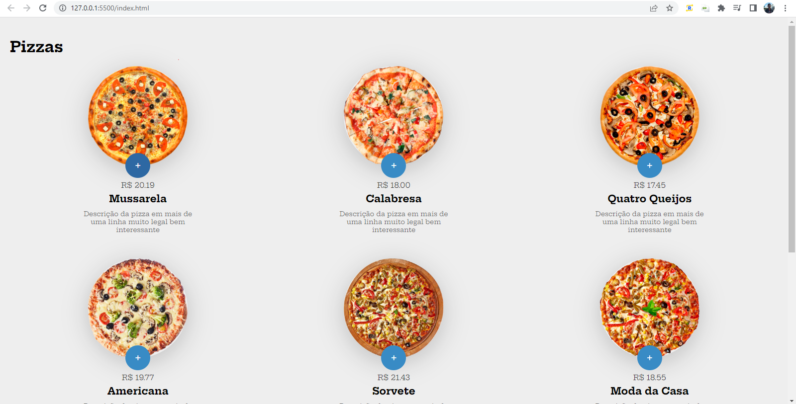
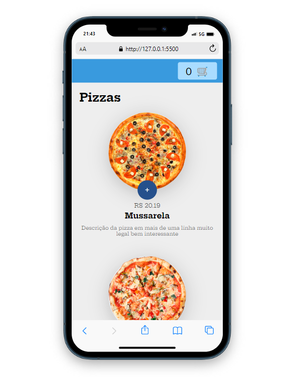
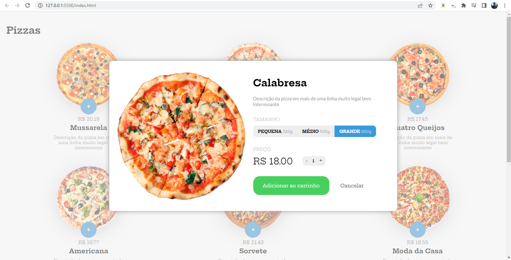
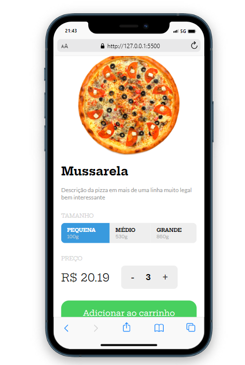
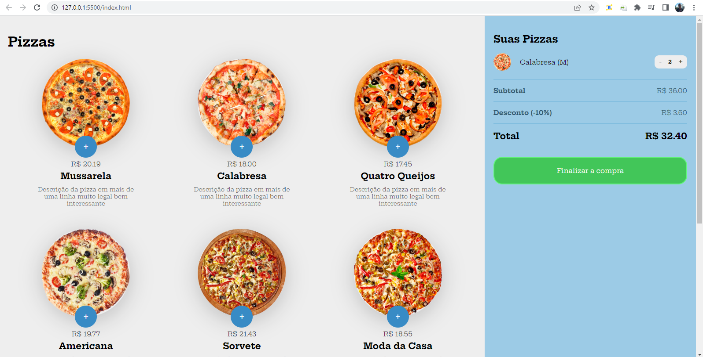
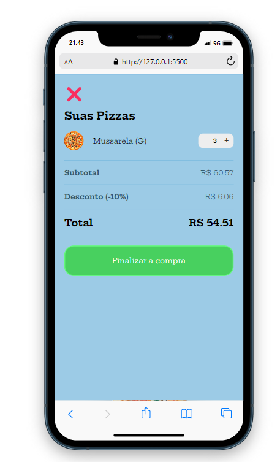

# Projeto_Compra_Pizzas

Projeto proposto pela B7Web que simula um app para compra de pizzas.



# Descrição:



Este projeto foi um dos principais do curso de JavaScript onde focamos na criação de uma loja online que vende pizzas, além disso o HTML e Css foram oferecidos pelo mentor. 

* JavaScript:

- pizzas.js: Contém as informações das pizzas que serão utilizadas na casa e para toda a dinâmica do projeto.

# script.js:



- Variáveis ​​Globais:

```
let cart = [];
let modalQt = 1;
let modalKey = 0;
```



cart é responsável por conter os produtos que foram adicionados pelo usuário.
modalQt é responsavel por fazer a contagem de produtos.
modalKey é usado como variável auxiliar para selecionar produtos e seus atributos.

- Funções:

```
function Clone(element){
    return document.querySelector(element);
}
function CloneAll(elements){
    return document.querySelectorAll(elements);
}
```

Estas funções são usadas para selecionar um elemento ou elementos DOM e reduzir a repetição do ``` document.querySelector ``` por algo mais simples.

```
function CloseModal(){
    Clone('.pizzaWindowArea').style.opacity = 0;
    setTimeout(()=>{
        Clone('.pizzaWindowArea').style.display = 'none';
    },500);
}
```

Esta função "controla" o modal responsável do MiniCart, no caso a animação de fechar.



```
function updateCart(){
    Clone('.menu-openner span').innerHTML = cart.length;

    if(cart.length > 0){
        let subtotal = 0;
        let desconto = 0;
        let total = 0;

        Clone('aside').classList.add('show');
        Clone('.cart').innerHTML = '';
        for(let i in cart){
            let pizzaItem = pizzaJson.find((item)=>{
                return item.id === cart[i].id;
            });
            subtotal += pizzaItem.price * cart[i].qt;
            let cartItem = Clone('.models .cart--item').cloneNode(true);
            let pizzaSizeName;
            switch (cart[i].size){
                case 0:
                    pizzaSizeName = 'P';
                    break;
                case 1:
                    pizzaSizeName = 'M';
                    break;
                case 2:
                    pizzaSizeName = 'G';
                    break;
            }
            let pizzaName = `${pizzaItem.name} (${pizzaSizeName})`;
            cartItem.querySelector('img').src = pizzaItem.img;
            cartItem.querySelector('.cart--item-nome').innerHTML = pizzaName;
            cartItem.querySelector('.cart--item--qt').innerHTML = cart[i].qt;
            cartItem.querySelector('.cart--item-qtmenos').addEventListener('click',()=>{
                if(cart[i].qt > 1){
                    cart[i].qt--;
                } else {
                    cart.splice(i, 1);
                }
                updateCart();
            });
            cartItem.querySelector('.cart--item-qtmais').addEventListener('click',()=>{
                cart[i].qt++;
                updateCart();
            });
            Clone('.cart').append(cartItem);
        }
        desconto = subtotal *0.1;
        total = subtotal - desconto;
        Clone('.subtotal span:last-child').innerHTML = `R$ ${subtotal.toFixed(2)}`;
        Clone('.desconto span:last-child').innerHTML = `R$ ${desconto.toFixed(2)}`;
        Clone('.total span:last-child').innerHTML = `R$ ${total.toFixed(2)}`;
    } else {
        Clone('aside').classList.remove('show');
        Clone('aside').style.left = '100vw';
    }
}
```

A função updateCart Adiciona o produto que o cliente selecionou ao minicart. 
Esta função começa validando se o minicart já tem um produto, caso não tenha, faz a adição de produtos e reseta as variáveis.
Além disso, faz a validação de preço, tipo e tamanho.

As demais funções são utilizadas para ativar o modal para efetuar a compra e deletar e adicionar produtos que estão no minicarrinho.

